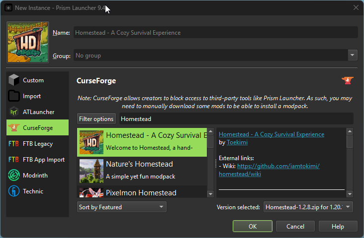
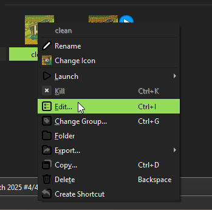
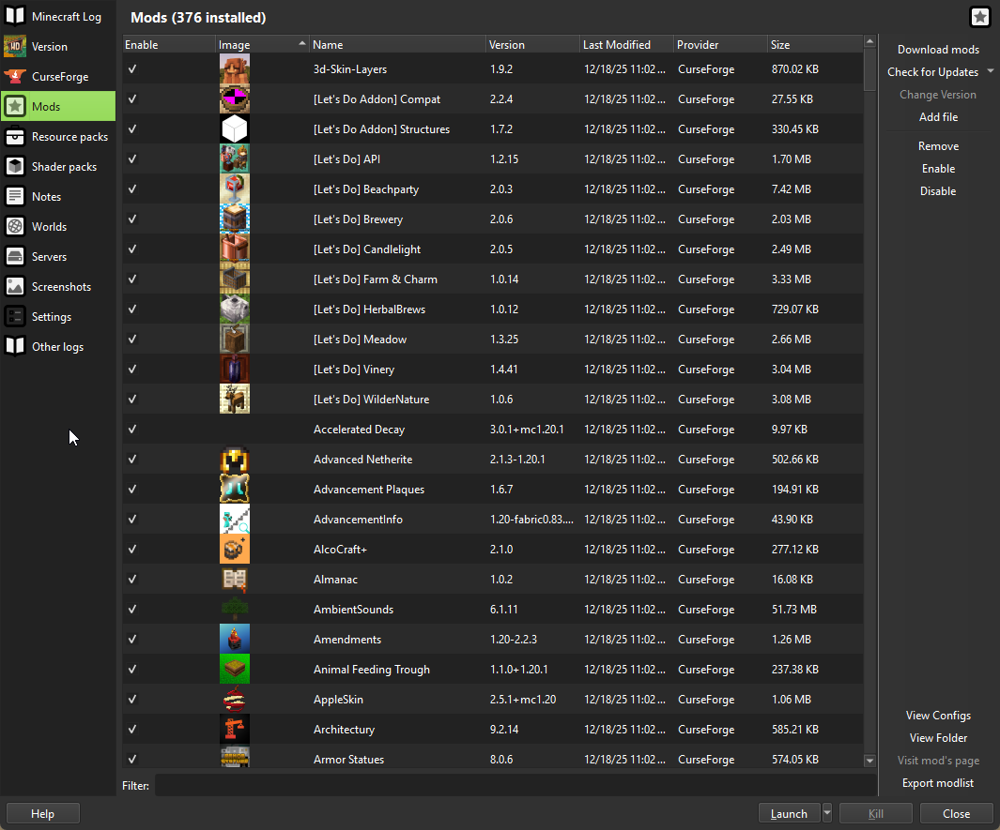
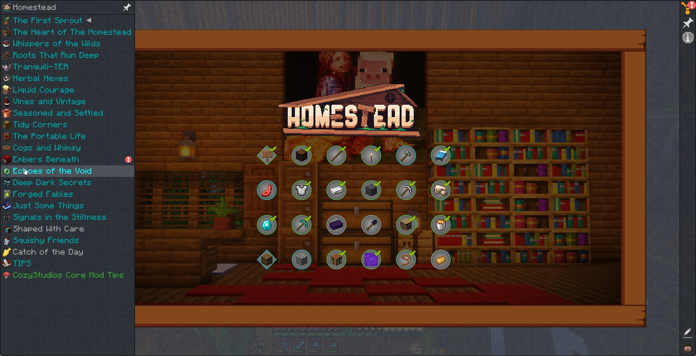

# Install

## Prism

### Download and Install

Download and install Prism: [Prism Launcher](https://prismlauncher.org/)

### Setup

#### Account

Sign into your Microsoft Account.

1. Select the account button in the top right. Then select "Manage Accounts".

2. Select "Add Microsoft" in the top right.

3. Open the link provided in the dialog box and enter the **bolded** code into the website.

4. Sign into your Microsoft account and allow Prism access to your Mircosoft account.

#### Instance

1. Select "Add Instance" in the top left of the Prism launcher.

2. Select "Curse Forge" -> Search for and select "Homestead". Select ok.

3. If you get a pop-up about *Blocked* mods, Make sure your downloads folder is selected and hit ok. If for some reason you get another warning saying some mods couldn't be downloaded autmoatically, click the provided links and download the mods to your Downloads folder. Prism will find them and import them automatically.

4. If you get a warning about *Incompatible* mods. Dm me on discord and I'll help you get the right ones.

5. Once it's finished downloading all the mods. Double click the icon in Homestead icon in Prism to launch. The first launch can take quite a while, but if you don't get an error immediately it's probably working, just give it time.

6. ***IMPORTANT*** Additonal mods.

- Secure Client Connection: [modflared](https://cdn.modrinth.com/data/uRHq6kbO/versions/sdUluPhe/modflared-1.2.0%2Brelease.61.jar) this creates a direct cloudflare tunnel connection to our server. Secure and safe and you don't have to configure anything. You ***MUST*** install this or you will not be able to connect.
  - Steps:
      1. Right click the instance and select edit.

      

      2. Select the mods section. Either drag and Drop the additional mods into this window, or select add file and add the mod through your file browser.

      

## Game

### Joining

1. DM me with your Minecraft username. I'll add you to the Whitelist and give you the server address in return. Just enter the URL into the server address bar of a new multiplayer server.

### Settings / Tips

1. When you first spawn in, hit `V` on your keyboard to setup voice chat, if you are interested in doing that.

2. Open your inventory, in the top left select "Quests", or the book in your inventory. This should give you some directions to begin your journey with.

3. There is a lot to this pack. I highly suggesting reading through all the quest lists. Hit the arrow on the left sidebar when viewing a set of quests to select different quest sections. These are mostly seperated by mod or dimension.

4. You can set a home teleport location by typing `/sethome` in game. Then at any point you may type `/home` to be transported home instantly.
